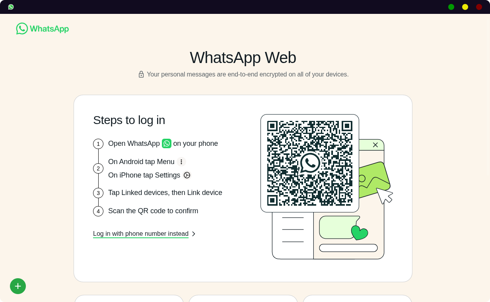

# Whatsapp Desktop Unix 
> ini sebenarnya webview dari whatsapp web yang di tampilkan kembali dalam mode desktop dan bisa multi account

 

	
 
 

---

## True Story 🤫
Saya adalah seorang mahasiswa dan punya pasangan juga sebagai mahasiswa sesama it. Singkat cerita saya selalu saling terhubung akun satu sama lain yang membuat kita harus punya 2 whatsapp di device utama kita. 

Masalah terjadi ketika saya menggunakan sistem operasi Linux dan browser Firefox. dalam Firefox sangat sulit menggunakan mode switch profile serta di Linux tidak ada khusus aplikasi untuk WhatsApp client.

Sebelumnya di Windows amat sangat mudah karena browser menggunakan chrome dan juga ada pula WhatsApp client resmi di Microsoft Store.

Sempat mencari cari edisi WhatsApp client di linux yang sama namun aku ragu akan keamanan nya. Dengan begitu saya memutuskan membuat WhatsApp client pribadi dengan fitur tentunya kita juga butuhkan.

## Preview

  
    diambil tahun 18/07/2025

